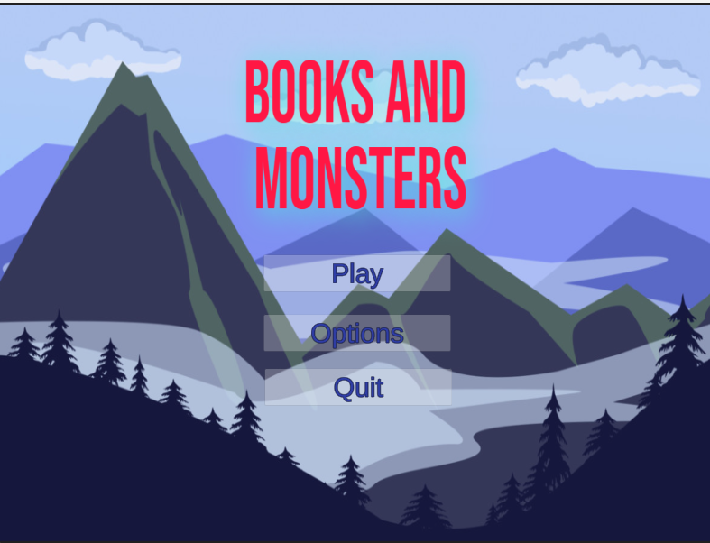
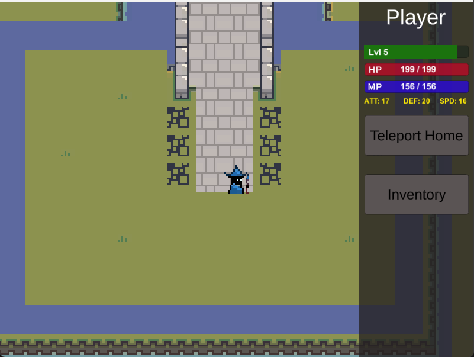
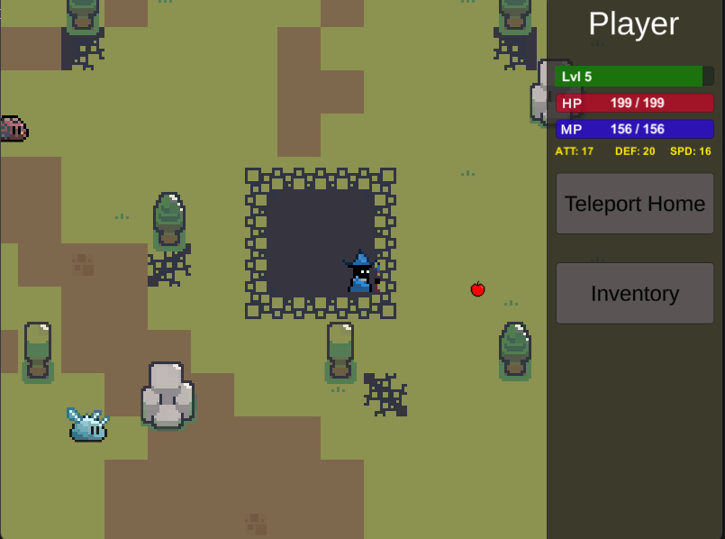
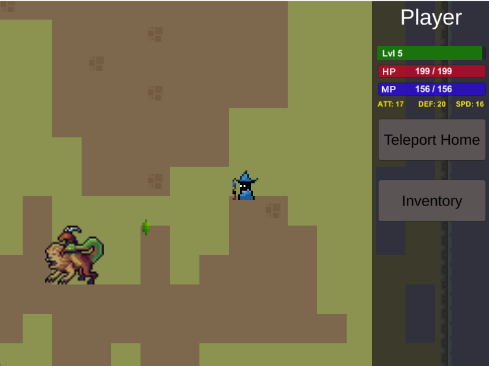
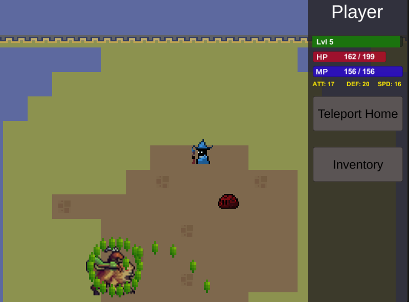

# Books and Monsters

## Game Overview

Welcome to the magical world of "Books and Monsters," where books hold immense power, and you, as a wizard, embark on a quest to collect and protect rare and powerful books from dungeons filled with dangerous monsters. Your mission is to defeat these monsters, retrieve the books, and restore peace to the land. Beware, for this RPG adventure takes a unique twist—it's a bullet hell game. Dodge monster attacks while unleashing your wizardry skills to become the ultimate wizard king.

## System Requirements

- **Platform:** PC (Windows)
- **Minimum Requirements:** Quad-core CPU, 4GB RAM, and a decent graphics card.

## Installation

1. Download and extract the zip file.
2. Run Books and Monsters.exe file.
3. Launch the game and begin your journey in the world of Books and Monsters.

## Gameplay Features

- **Explore:** Traverse the magical world, uncover dungeons, and face challenging enemies.
- **Combat:** Engage in fast-paced bullet hell combat, dodging monster attacks while defeating them.
- **Loot:** Collect the best loot, level up, and become the wizard king.
- **RPG Elements:** Experience character progression, discover the source of monsters, and restore peace.
  
  
  

**Note:**
This project was completed as part of a group project for CS9541 - Game Design. Credit goes to the talented group members:

- Sundin Nguyen
- Matt Baker
- Thuyavan
- Nashita Shaik
